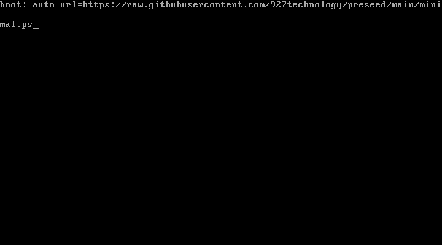

Unattended Debian based installer.

|Architecture|Link|
|:-|:-|
|x86_64|https://cdimage.debian.org/debian-cd/current/amd64/iso-cd/debian-11.7.0-amd64-netinst.iso|


1. Boot Media

    

2. Interupt the boot menu by pressing \<ESC\>

    

3. Append 
    ```
    auto url=https://raw.githubusercontent.com/927technology/preseed/main/minimal.ps
    ```
    

4. Press \<Enter\>
  
  
